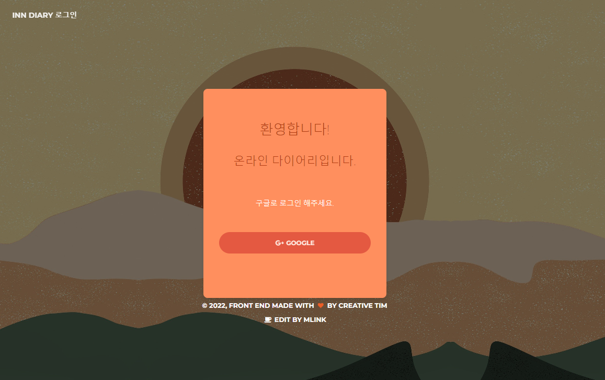
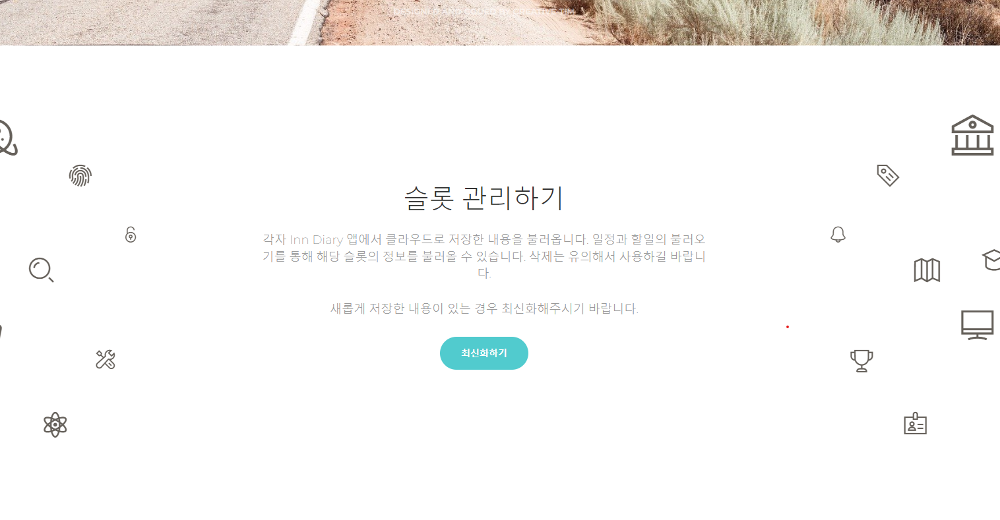
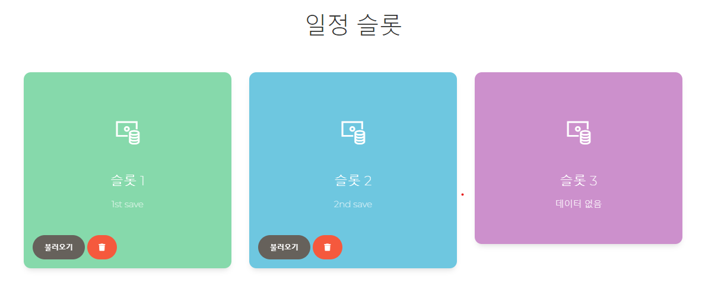
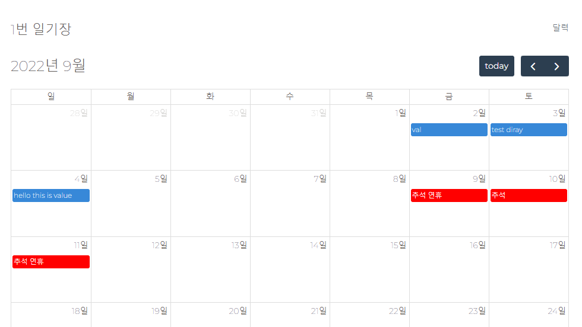

# spring-InnDiary
#
## Inn Diary 사이트

- 제목 : Inn Diary 웹 프로젝트

- 프로젝트 : 개인 프로젝트 

- 개발 언어 : Java

- 프레임워크 : Spring, Spring Boot

- 개발 의존 : Spring Security, Spring MVC, Thymeleaf, JPA, QueryDSL, OAuth2.0

- 개발 환경 : intellij IDEA, HeidiSQL, Firebase, WSL, GCP(Google Cloud Platform)

- DB : MariaDB

- 기간 : 2022. 07. ~ 09. | 리펙토링 : 2022. 10. ~

- 배포 환경 : AWS EC2

---

# 요구사항
* 간편한 로그인과 앱과의 연동성을 위해 기존 구글 계정을 통한 로그인
* Firebase에 앱에서 저장한 데이터를 웹에서 불러와 사용
* 사용자는 여러 슬롯에서 일정과 할 일의 정보를 관리할 수 있음
* 달력을 통해 일기, 할 일 정보를 쉽게 볼 수 있음
* 목록에서 일기, 할 일의 정보를 볼 수 있음
* 일기의 정보는 상세 조회 가능

# 상세 구현

로그인 화면


로그인 후 화면


슬롯 관리 화면


일기(일정) 슬롯과 할 일 슬롯으로 관리


달력을 통해 조회 가능

# 로직
### 처음 접속 시
- 처음 접속하게 되면 바로 로그인을 해야되고, 앱을 사용한 적 없으면 로그인 불가능

로그인 하지 않은 사용자도 할 수 있는게 좋지 않을까?
앱에서 로그인 하지 않았어도 로그인이 가능하게


### 로그인  
- 로그인 로직은 인터넷에서 오픈 소스를 활용해 작성
- 해당 로직은 특정 로그인 서비스 제공자(구글)의 허용 리다이렉트 URI로 로그인 요청을 보내면 해당 서비스의 로그인을 허용
- 이를 통해 로그인 성공 시 유저의 정보를 받아옴
- 이때 Firebase에서 로그인 했던 유저인지 확인하는 절차를 추가함


```java
    @Override
    public OAuth2User loadUser(OAuth2UserRequest userRequest) throws OAuth2AuthenticationException {
        OAuthAttributes attributes = userInformationLoad(userRequest);

        UserEntity user = saveOrUpdate(attributes);
        httpSession.setAttribute("user", new SessionUser(user));

        return new DefaultOAuth2User(
                Collections.singleton(new SimpleGrantedAuthority(user.getRoleKey())),
                attributes.getAttributes(),
                attributes.getNameAttributeKey());
    }

    private OAuthAttributes userInformationLoad(OAuth2UserRequest userRequest) {
        OAuth2User oAuth2User = delegate.loadUser(userRequest);

        String registrationId = userRequest.getClientRegistration().getRegistrationId();
        String userNameAttributeName = userRequest.getClientRegistration()
                .getProviderDetails().getUserInfoEndpoint().getUserNameAttributeName();
        String uid = "";

        try {
            uid = firebaseRegister(oAuth2User.getAttributes().get("email").toString());
        } catch (ExecutionException | InterruptedException ex) {
            log.info("error occur cause of no user data found in firebase Users data.", ex);
            throw new OAuth2AuthenticationException("UNAUTHORIZED_CLIENT");
        }

        return OAuthAttributes.of(registrationId, userNameAttributeName, oAuth2User.getAttributes(), uid);
    }

    private String firebaseRegister(String email) throws ExecutionException, InterruptedException {
        UserRecord userRecord = FirebaseAuth.getInstance().getUserByEmailAsync(email).get();
        log.info("user data find successful");

        return userRecord.getUid();
    }
```
Google Cloud Platform 제공 로그인을 사용하면서 Firebase Authentication에서 사용하는 User DB를 조회하게 됨, 로그인 시 한 번의 인증이 아닌 앱 사용자인지 두 번 확인하는 절차가 있음

정말 유용한가?

### 슬롯
- 슬롯은 데이터를 Firebase를 통해 불러온 DataSnapshot을 통해 가져옴
  - 이때 해당 User의 Uid를 통해 가져옴
- 가져온 Slot을 DB에 최신화하는 로직
  - 해당 로직은 DB에 저장된 슬롯의 모든 데이터를 삭제하고 다시 입력하는 방식
  - 부하가 많이 올거라고 추측
- 각자 일기, 할 일의 슬롯을 가져오면 해당 슬롯의 데이터를 불러와 달력과 목록에서 보여줌

```java
    @Override
    public List<Slot> processAllSlotFromFirebaseData(User u) {
        List<Slot> rs = new ArrayList<>();

        for (Integer i :isAnySlotHasData()) {
            SlotMeta s = settingSlotMeta(firebaseJsonRepository.getWhichSlotNumData("diarySlot", "slot" + i), i);

            rs.add(Slot.builder()
                    .slotNum(i)
                    .userSeq(u.getId())
                    .userName(u.getName())
                    .userEmail(u.getEmail())
                    .userUid(u.getUid())
                    .title(s.getTitle())
                    .which("diary")
                    .modDate(stringToLocalDate(s.getModDate()))
                    .build());
        }
        return rs;
    }

    private SlotMeta settingSlotMeta(DataSnapshot ds, int i) {
        GenericTypeIndicator<List<DiaryMeta>> tD = new GenericTypeIndicator<List<DiaryMeta>>() {};

        SlotMeta s = ds.getValue(SlotMeta.class);
        List<DiaryMeta> dList = ds.child("diaryList").getValue(tD);

        diaryDataAll.put(i, dList);

        return s;
    }

    private LocalDate stringToLocalDate(String time) {
        LocalDate ldt = null;

        if (time.length() > 8) {
            ldt = LocalDate.parse(time, DateTimeFormatter.ofPattern("yyyyMMddHHmm"));
        }
        else {
            ldt = LocalDate.parse(time, DateTimeFormatter.ofPattern("yyyyMMdd"));
        }

        return ldt;
    }

    @Override
    public List<Integer> isAnySlotHasData() {
        List<Integer> isSlotExists = new ArrayList<>();

        for (int i = 1; i <= 3; i++) {
            if (firebaseJsonRepository.getWhichData("diarySlot").hasChild("slot" + i)) {
                isSlotExists.add(i);
            }
        }
        return isSlotExists;
    }
```
이 로직에서 stringToLocalDate 함수는 공통적인 부분이다. 새로운 클래스에 중복 코드를 빼내야 함
게다가 FirebaseServiceImpl를 보게되면 diary, todo에 대해 한 소스파일에 존재한다는 것을 알 수 있음 
분리하는 쪽이 클래스의 기능을 줄이는 일이 될 것

해당 로직에 대해 멀티 환경에서 테스트 결과, 가장 처음에 로그인했던 아이디의 Uid 값을 유지하고 있거나 새롭게 로그인한 사용자의 Uid의 슬롯에 대해서 불러오지 못함

### 일기와 할일
- 일기와 할일 달력은 DB에서 해당하는 월의 데이터를 가져와 JSON 형식으로 바꿔 API를 통해 전달
- 목록은 이번 달의 일기와 할일만 보여줌

```java
    @GetMapping("/calendars/values/now")
    @ResponseBody
    private JsonNode callDiarySearch(@RequestParam String start, @RequestParam String end) throws JsonProcessingException{
        LocalDate startDate=stringToLocalDate(start);
        LocalDate endDate=stringToLocalDate(end);
        List<Diary> monthDiary=diaryService.findBetweenMonthDiary(startDate,endDate);

        return objectMapper.readTree(diaryToDiaryJson(monthDiary).toString());
    }

    private LocalDate stringToLocalDate(String time) {
        String[] ts = time.split("T");
        LocalDate ldt = null;

        if (ts[1].equals("00:00:00+09:00")) {
            ldt = LocalDate.parse(ts[0], DateTimeFormatter.ofPattern("yyyy-MM-dd"));
        }
        else {
            String parsedTime = ts[0] + "T" + parseStringTimeToLocalDate(ts[1]);
            ldt = LocalDate.parse(parsedTime, DateTimeFormatter.ofPattern("yyyy-MM-ddTHHmm"));
        }

        return ldt;
    }

    private String parseStringTimeToLocalDate(String time) {
        String[] onlyTime = time.split("\\+");
        String[] hourMinSec = onlyTime[0].split(":");

        return hourMinSec[0] + hourMinSec[1];
    }

    private List<String> diaryToDiaryJson(List<Diary> diaries) throws JsonProcessingException {
        List<String> result = new ArrayList<>();
        Map<String, Object> dMap = new HashMap<>();

        for (Diary d : diaries) {
            dMap.put("id", d.getDiarySeq().toString());
            dMap.put("title", d.getTitle());
            dMap.put("url", "/diaries/" + d.getDiarySeq());
            dMap.put("start", d.getDate().toString());
    
            result.add(objectMapper.writeValueAsString(dMap));
            dMap.clear();
        }
        return result;
    }
```
중복 코드인 stringToLocalDate, parseStringTimeToLocalDate를 제거해야 함

# 문제점
실제 시행 시 페이지의 URL간 이동 시 null 발생이나 오류 발생 시 500 페이지로 넘어가는 문제가 발생되었다.
해당 문제들을 해결해야한다.

로그인 시 2번 인증하는 부분이 효율적이지 못하다. Firebase 인증 부분은 앱과의 연동때만 사용한다.

슬롯의 최신화 시 아무래도 서버의 DB와 Firebase 클라우드 DB의 사용이 효율적이지 못하다. 이를 앱 사용자와 서버 사용자로 
두고 앱 사용자의 경우 Firebase 서버의 Realtime DB를 통합 사용할 예정이다. 서버 사용자가 앱과 연동할 경우 서버 사용자의
데이터를 Firebase로 옮기고 서버 DB에서 전부 지운다. 해당 유저는 계속 Firebase DB로 사용한다.

---

# 리펙토링
위의 문제점과 코드의 정리를 위해 리펙토링을 진행합니다.

## 추가 기능
- 접속 시 로그인 페이지가 아닌 메인페이지에서 공유된 일기를 볼 수 있습니다.
- 일기에 댓글을 달 수 있다.
- 그룹을 생성해 특정 인원과만 일기를 공유할 수 있다.
- 일기, 할 일 삭제, 수정

### 1. 코드 정리
우선 코드의 지저분한 부분 중복 코드와 필요없는 부분, 디렉토리 구조를 정리

### 2. 오류 수정
테스트 코드 작성과 기존의 500 에러 및 동기화 오류 수정

### 3. 로직 변경
서버 DB에서 Firebase DB로 변경에 맞게 수정, firebase 자체의 권한 수준 변경

### 4. 새로운 기능 추가
새롭게 추가할 기능들 추가
